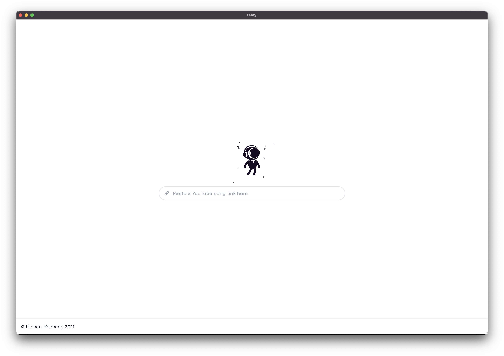
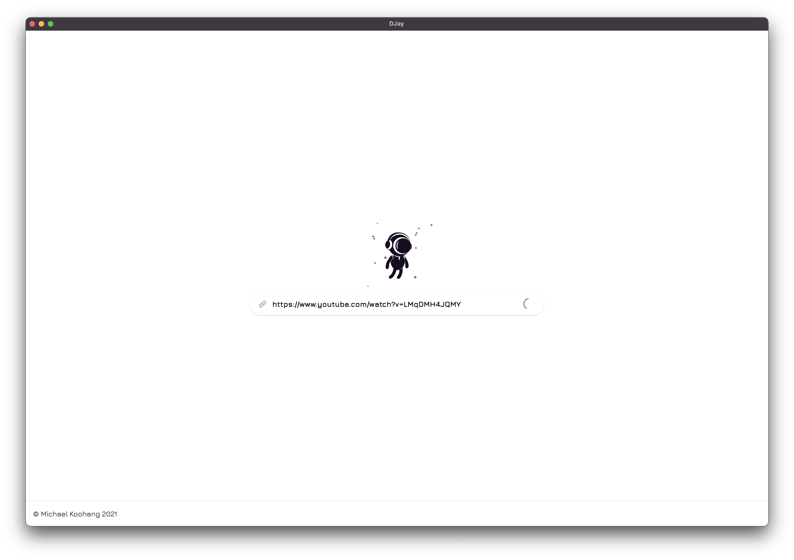
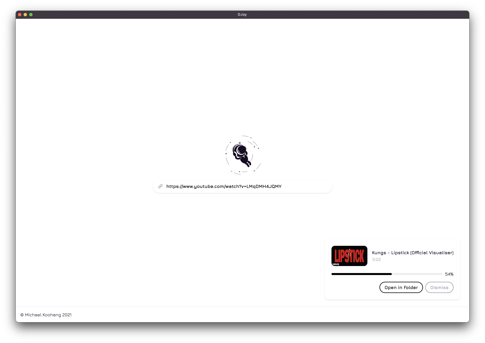
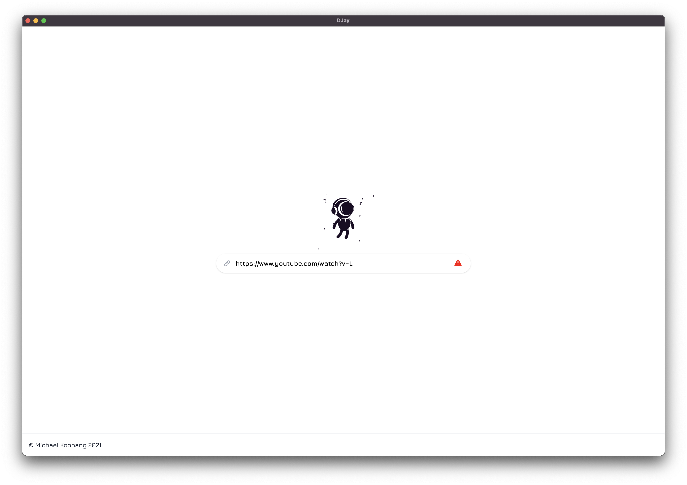

# DJay

## About

I really enjoy DJing for my friends whenever I can. I've put on small sets in the past, but I've always been limited by the DJ software on my computer. Most recently, Spotify decided to stop supporting the DJ software I use to perform, so I lost access to all of my songs and playlists.

Determined to right this wrong and find absolutely any other possible solution besides buying another subscription service, I built DJay, an electron app that lets me download audio files for any song I can find on YouTube. Now I can build my DJ sets by downloading local files and curating them into folders on my local computer instead of relying on a subscription service to do the work for me!

## How it Works

DJay looks a lot like Google but space-themed. It has a search bar where you can paste a YouTube link. Once the link is pasted and you hit enter, the song starts to download to your Downloads folder. A card will appear in the bottom right hand corner showing you the progress of the download and allowing you to view the file after it's finished downloading. What's left is an MP3 copy of that YouTube video's audio.

To make the app a little more interesting, I gave it a space-theme along with a futuristic font and little astronaut animation that changes whenever you start downloading a song. I also went crazy with animations, making everything fade, slide, and scale to ensure all the interactions were buttery smooth. There's also error handling in the search bar to catch bad input.

### Home

### Loading Link

### Downloading Audio

### Link Error

## Install

1. Clone the repository
2. Cd in the root directory
3. Run `yarn install`
4. Run `yarn start`
5. Enjoy ;)

> I will eventually distribute this as a native app so that you can download it and add it to your applications folder.

## Built with

- [Electron](https://www.electronjs.org)
- [React](https://reactjs.org)
- [TailwindCSS](https://tailwindcss.com)